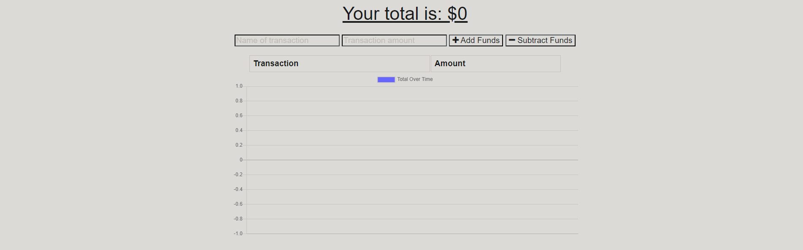
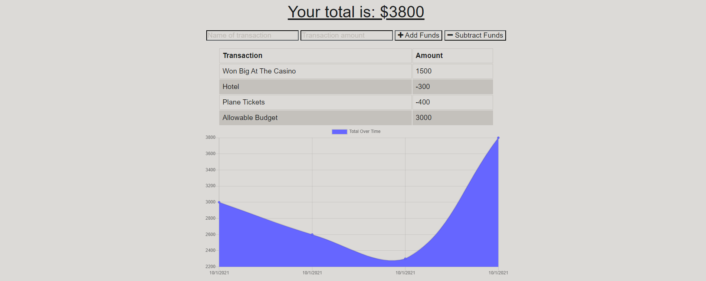

# PWA: Online/Offline Budget Tracker

## Purpose

The purpose of this project was to add to the functionality of an existing budget tracking application. This added functionality is to be able to add line items to the budget while not connected to the internet and to be able to install the application locally to your device. 

Some features of the app are:

- Users are able to add line items to the budget to either increase or decrease the total. 
- When not connected to the internet the users entries are saved locally and inserted into the online database when internet connection is restored. 
  - Locally stored information is cleared once it has been entered into the online database. 
- The user is shown a graph for a visual representation of their budget. 
- As this is a Progressive Web App, the user can install the application directly to their machine. 

The application can be found at: https://whispering-brook-23469.herokuapp.com/

---

## Appearance

### Here is an example of the application when a user first visits it:

### Here is an example of the application once the user has entered budget items:

